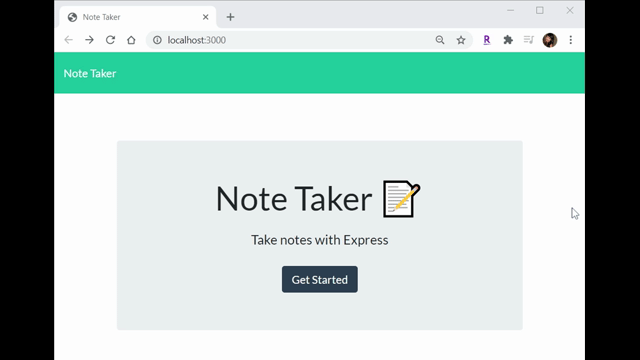

# Note Taker

This Note Taker application was created to be used to write, save, and delete notes. This application uses an express backend and saves and retrieves note data from a JSON file. 

 

## Coding Process

The following routes were created with:

HTML routes:
* GET `/notes` - returns the `notes.html` file

* GET `/` - returns the `index.html` file

API routes:
  * GET `/api/notes` - Should read the `db.json` file and return all saved notes as JSON

  * POST `/api/notes` - recieves a new note to save on the request body

  * DELETE `/api/notes/:id` - recieves a query paramter containing the id of a note to delete. 

 

To view this application, please navigate to the **Heroku Deployed Link** below or  [click here](https://sheltered-atoll-51150.herokuapp.com/) to view.

 

## Powered By

* [Javascript](https://developer.mozilla.org/en-US/docs/Web/JavaScript)
* [Node.js](https://nodejs.org/en/)
* [npm install](https://nodejs.org/en/)
* [express nodejs](https://www.npmjs.com/package/express)
* [uuid nodejs](https://www.npmjs.com/package/uuid)
* [Heroku](https://www.heroku.com)

 

### Other Resources Used

* [Visual Studio Code](https://code.visualstudio.com/)
    * [How to install VS Code](https://code.visualstudio.com/docs/setup/setup-overview)
* [GitBash](https://gitforwindows.org/)
    * [Download GitBash for Windows](https://git-scm.com/downloads)

 

## Heroku Deployed Link

* [See Deployed Link](https://sheltered-atoll-51150.herokuapp.com/)

 

## Author
**Christy Lee** 

- [Github](https://github.com/christyglee)
- [LinkedIn](https://www.linkedin.com/in/christy-g-lee/)

  

## Acknowledgments

* [Google-Fu](https://www.google.com)
* [w3schools](https://www.w3schools.com/)
* [Stack Overflow](https://stackoverflow.com/search?q=over)
* [Node.js](https://nodejs.org/en/)
* [npm install](https://nodejs.org/en/)
* [Heroku](https://www.heroku.com)